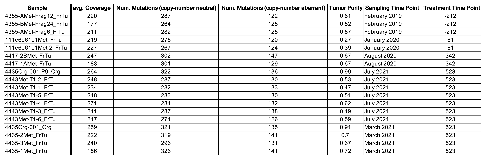
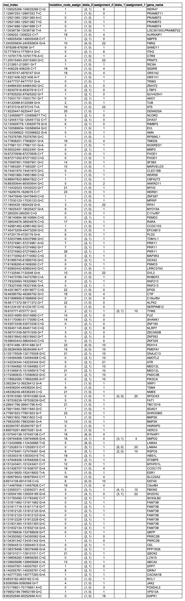

## Real dataset

## Multi-region longitudinal bulk DNA sequenced samples from metastatic breast cancer (mBrCa) patient
**(below)** We provide a summary table for the tumour metastases samples (from patient 4355 in [^3]) that were analysed in the main paper introducing `DETOPT`. The raw `.tsv` file can be downloaded [here](demo_outputs/sample_summary.tsv).

## Longitudinal consistency of base tree topology
<!---**(on left)** A heatmap shows the average descendant cell fraction (DCF)[^1] of copy number neutral SNVs in each subclone (row) in each sample (column). The average DCF of a mutational cluster, i.e., subclone, is the proportion of cells in a sample that harbor those mutations; this includes both the subclone in which the mutation was first acquired and all its descendants. Here, we have grouped and ordered subclones such that the ancestor-descendant relationships in the base tree are represented as best as possible [^2]. As it can be seen, the order of the subclones in our base tree is not only (i) consistent with the chronological order in which samples were obtained, but also (ii) consistent with the DCFs of subclones within a sample. To observe (i), for any pair of subclones (rows), a subclone that is present only in samples from a later time point is always a descendant of a subclone that is present at an earlier time point. To observe (ii), in a sample (column) for any pair of subclones (rows), the ancestral subclone always has a higher DCF than the descendant subclone. **(on right)** Base tree topology as shown in Figure 3 of the manuscript. Subclones (nodes) are colored based on the earliest sampling time point at which the subclone was first observed. Similar to the heatmap, in this complementary visualization, the longitudinal structure of the base tree is apparent. The raw `.tsv` file for the heatmap can be download [here](demo_outputs/4355_dcf_table.tsv).--->

**(on right)** A tree of tumor progression reported in Figure 3 in the main text of the `DETOPT` manuscript is shown (see the caption in the main text for the description of node and edge labels and see below for the description of coloring of tree nodes). Sequencing data used to build the tree were obtained from 18 samples taken at four different time points (212 days before and 81, 342 and 523 days after treatment) and from distinct metastases. These time points are associated with different colors as shown in the figure. **(on left)** A heatmap shows inferred cellular prevalence values of mutations assigned to a given subclone/node in a given sample. For example, the value for subclone/row 14 in sample/column 4435-2Met_FrTu is equal to 0.48, indicating that in sample 4435-2Met_FrTu, mutations that occur for the first time at subclone/node 14 are present in 48 percent of cells. On the other hand, the value of node/subclone 5 for the same sample is 0 indicating that mutations occurring for the first time at node/subclone 5 are absent from this sample. Each node of the tree was colored in the color of the time points at which mutations assigned to that node were first observed. For example, the color of node 4 matches the color of sampling done 81 days after treatment. Looking into the heatmap, we can observe that mutations assigned to this node were absent in all samples sampled at the first timepoint, whereas among the samples sampled (we should change this expression "samples sampled") at the second timepoint these mutations were present in sample 111e6e61e1Met-2_FrTu at a frequency of 27% (note that the absence of these mutations in the other sample obtained at this timepoint 111e6e61e1Met_FrTu is most likely due to intratumoral heterogeneity and absence of this subclone in this sample). Here, we have grouped and ordered subclones such that the ancestor-descendant relationships in the base tree are represented as best as possible [^2]. As it can be seen, there is consistency with the chronological order in which samples were obtained. For any pair of subclones, a subclone that has mutations specific to it, are present for the first time only in sample(s) from a later time point is always a descendant of a subclone that has mutations specific to it present for the first time at an earlier time points (here, by mutations specific to a subclone we refer to the set of mutations that appear for the first time at that subclone). The raw `.tsv` file for the heatmap can be download [here](demo_outputs/4355_dcf_table.tsv).

  
  

## Output of `DETOPT` on patient 4355 data
We provide the output for running `DETOPT` on patient 4355 data. The raw `.tsv` file can be downloaded [here](demo_outputs/variant_placements.tsv).

<!-- References -->
[^1]: Satas, G., Zaccaria, S., El-Kebir, M., Raphael, B.J.: Decifering the elusive cancer cell fraction in tumor heterogeneity and evolution. Cell Systems 12(10), 1004–1018 (2021) [http://dx.doi.org/10.1016/j.cels.2021.07.006](http://dx.doi.org/10.1016/j.cels.2021.07.006)
[^2]: Because there are branching events, there are some instances on the heatmap where two consecutive rows do not preserve the ancestor-descendant relationship, e.g., both row (subclone) 17 and row (subclone) 14 are descendants of row (subclone) 4 but in the heatmap, we can only place row 14 under row 4.
[^3]: Zacharakis, N., Huq, L.M., Seitter, S.J., Kim, S.P., Gartner, J.J., Sindiri, S., Hill, V.K., Li, Y.F., Paria, B.C., Ray, S., et al.: Breast cancers are immunogenic: immunologic analyses and a phase ii pilot clinical trial using mutation-reactive autologous lymphocytes. Journal of Clinical Oncology 40(16), 1741–1754 (2022) [https://doi.org/10.1200/jco.21.02170](https://doi.org/10.1200/jco.21.02170)
